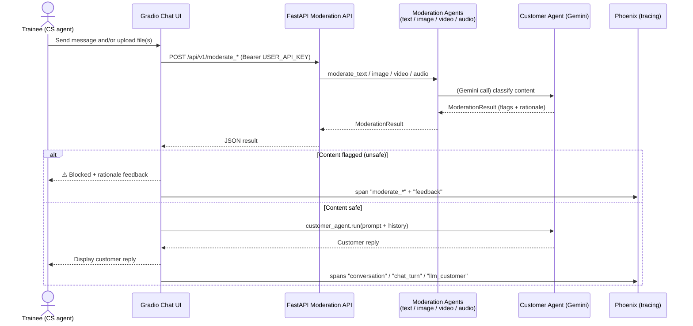
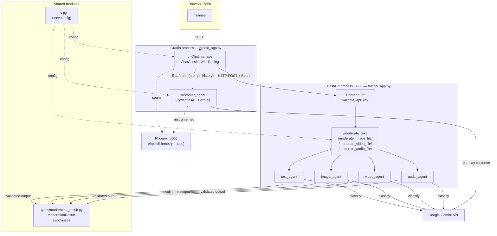

# OmniTrainer: Multimodal Customer Service Trainer

This project holds a customer service trainer. It'll use various agents which will evaluate the customer service agent's performance. To get started, we should have an `.env` configured correctly. There's an `env.example` in the root of the repository. You need to configure the gemini endpoint, as well as the api key. The details are defined in the `env.example`.

## Functional Flow

A human trainee plays an ACME customer service agent in a chat. Every message and uploaded file is moderated *before* it reaches the simulated customer. Flagged content is blocked and explained back to the trainee; safe content is forwarded to an LLM that role-plays an unhappy customer. Every step is traced into Phoenix for later inspection.

## Technical Architecture

The system runs as **two processes** plus an embedded tracing collector, started together by `multimodal-moderation` (`app.py`):

- **Gradio app** (`gradio_app.py`) — the front end and conversation orchestrator. It calls the moderation API over HTTP and the customer agent directly in-process.
- **FastAPI app** (`fastapi_app.py`) — a Bearer-authenticated moderation service exposing one endpoint per modality, each delegating to a Pydantic AI agent.
- **Phoenix** (`app.py` → `tracing.py`) — OpenTelemetry trace collector + UI on port 6006.

All agents target Google Gemini via Pydantic AI and return a typed `ModerationResult` subclass. Configuration (API keys, model, URLs) is centralized in `env.py`.

### Request lifecycle in brief

1. `app.py` launches Phoenix, then spawns the FastAPI and Gradio processes.
2. Gradio's `check_content_safety()` POSTs each text/media item to the matching FastAPI endpoint with the `USER_API_KEY` bearer token.
3. The endpoint runs the corresponding moderation agent, which prompts Gemini and parses the reply into a typed `ModerationResult` (`contains_pii`, `is_unfriendly`, `is_unprofessional`, `rationale`, plus modality-specific flags).
4. If any unsafe flag is set, Gradio blocks the message and surfaces the rationale; the `"feedback"` is recorded on the trace span. Otherwise the content (text + `BinaryContent` files) is passed to `customer_agent.run(...)` with prior message history.
5. Spans (`conversation` with `session.id`, `chat_turn`, `moderate_*`, `llm_customer`) stream to Phoenix at <http://localhost:6006>.
